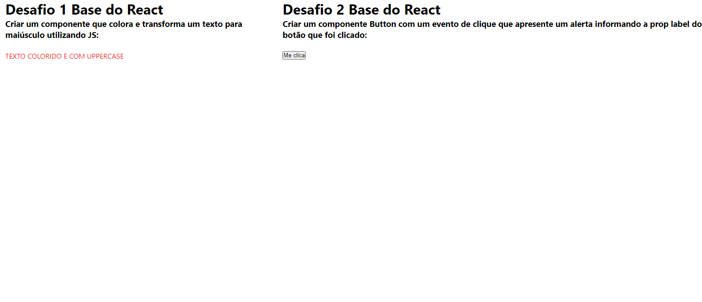

# Desafio React Basico

Este desafio, faz parte do treinamento Dev Quest, realizado pelo [Dev-em-Dobro](https://www.youtube.com/c/DevemDobro).

## Sumário

  - [Screenshot](#screenshot)
  - [O que foi usado?](#o-que-foi-usado?)
  - [O que eu aprendi](#o-que-eu-aprendi)

## Visão Geral

### Screenshot

### O que foi usado?

- HTML
- CSS
- Javascript
- ReactJS
